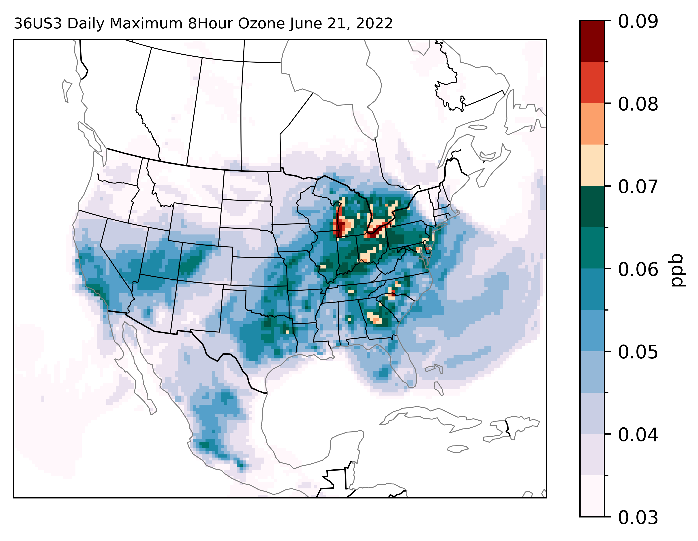

# Python Visualizations and Analysis of CMAQ Data

A series of short examples of generating visualizations of input and output files from the US EPA __[Commmunity Multiscale Air Quality Model (CMAQ)](https://github.com/USEPA/CMAQ/tree/main)__ using tools from the python ecosystem. These examples are provided for demonstrative purposes only. All tutorials are included in the __[examples](./examples)__ folder. 

Most features of the example notebooks can be seen directly through the GitHub previews (the primary exception is for all interactive visualizations), but if you would like to run the notebooks yourself, see the __[Getting Started](https://needham-michael.github.io/cmaq_visualization/setup/)__ page of the __[User's Guide](https://needham-michael.github.io/cmaq_visualization/)__

Change Log
----------
* __2024.07.19__ Initial Release
***

  

***

Issues and Requests
-------------------

If you have any problems, or would like to request a new example, you can __[open an issue on GitHub](https://github.com/needham-michael/cmaq_visualization/issues)__, or contact Michael Needham (__[needham.michael@epa.gov](mailto:needham.michael@epa.gov)__)

License
-------

Copyright 2024, Michael Needham

Licensed under the __[MIT License](./LICENSE)__